# 基于springboot的大学城水电管理系统

---
### 👉作者QQ ：1556708905 微信：zheng0123Long (支持定制修改、部署调试、定制毕设)

### 👉接网站建设、小程序、H5、APP、各种系统等

---

#### 介绍

随着大学城规模的不断扩大和设施的日益完善，水电资源的合理管理和有效利用变得至关重要。为了实现大学城水电管理的科学化、规范化和智能化，提高水电资源的利用效率，降低能耗，我们开发了这个基于 Spring Boot 的大学城水电管理系统。

#### 技术栈

后端技术栈：Springboot+Mysql+Maven

前端技术栈：Vue+Html+Css+Javascript+ElementUI

开发工具：Idea+Vscode+Navicate

#### 系统功能介绍

（一）管理员角色  
个人中心：管理员可以在此查看和修改个人信息，设置工作提醒等。  
用户管理：对大学城的用户进行信息登记、权限分配、账户启用或禁用等操作，确保用户信息的准确性和安全性。  
领用设备管理：监控和记录水电领用设备的情况，包括设备的种类、数量、领用时间、领用人等信息。  
消耗设备管理：掌握水电消耗设备的运行状况和消耗数据，分析设备的能耗情况，以便及时发现异常并采取措施。  
设备申请管理：处理用户提交的设备申请，根据实际情况进行审批和调配。  
设备派发管理：负责将审批通过的设备派发到指定地点和用户手中，并记录派发的相关信息。  
状态汇报管理：接收和查看水电设备的运行状态汇报，了解设备的实时情况。  
领用报表管理：生成和查看水电领用设备的报表，包括领用明细、汇总数据等，为管理决策提供数据支持。  
消耗报表管理：分析和统计水电消耗设备的消耗数据报表，以便掌握能耗趋势和制定节能策略。  
班组报表管理：针对不同的水电管理班组，生成工作报表，评估班组的工作绩效。  
个人报表管理：为每个管理员生成个人工作报表，反映其工作成果和效率。  
用户反馈管理：及时处理用户提出的反馈和意见，改进服务质量，提高用户满意度。  
维护保养管理：制定水电设备的维护保养计划，安排维护人员和任务，确保设备的正常运行和延长使用寿命。  
设备检测管理：对水电设备进行定期检测，记录检测结果和处理情况，保障设备的安全性和可靠性。  
设备修理管理：当设备出现故障时，安排修理人员进行维修，并跟踪修理进度和质量。  
报修信息管理：接收用户的报修信息，快速响应并安排维修工作。  
定期修复管理：制定定期修复计划，对可能存在隐患的设备进行预防性修复。  
修理计划管理：统筹规划设备修理工作，合理分配资源，确保修理工作的高效进行。  

（二）用户角色  
个人中心：用户可以修改个人信息，查看水电使用记录和相关通知。  
领用设备管理：申请领用水电设备，并查看领用设备的详情和状态。  
消耗设备管理：监控自身使用的消耗设备的情况，了解能耗数据。  
设备申请管理：提交设备申请，查看申请进度和审批结果。  
设备派发管理：接收派发的设备，并确认设备的完整性和可用性。  
状态汇报管理：向管理员汇报水电设备的运行状态，便于及时维护。  
用户反馈管理：向管理部门反馈水电使用过程中的问题和建议。  
报修信息管理：当设备出现故障时，及时提交报修信息。  

#### 系统作用

1. 提高管理效率  
实现了水电设备管理的信息化和自动化，减少了人工操作和纸质记录，大大提高了管理工作的效率。  
快速处理设备申请、派发、报修等流程，缩短了响应时间，提升了服务质量。  
2. 优化资源配置  
通过对领用设备和消耗设备的精确管理，能够合理调配资源，避免设备闲置和浪费。  
根据消耗报表和分析，制定节能措施，优化水电资源的使用。  
3。 保障设备正常运行  
完善的维护保养、检测和修理管理机制，确保水电设备的安全稳定运行，减少故障发生的概率。  
及时发现和解决设备问题，延长设备的使用寿命，降低设备更新成本。  
4. 增强用户满意度  
为用户提供便捷的服务，如设备申请、状态汇报和反馈渠道，提升用户参与度和满意度。  
快速响应用户的报修和需求，改善用户体验，营造良好的水电使用环境。  
5. 数据支持与决策制定  
系统生成的各种报表为管理部门提供了丰富的数据，有助于制定科学合理的管理策略和规划。  
基于数据分析，可以发现管理中的问题和不足，进行针对性的改进和优化。  

#### 系统功能截图

代码结构

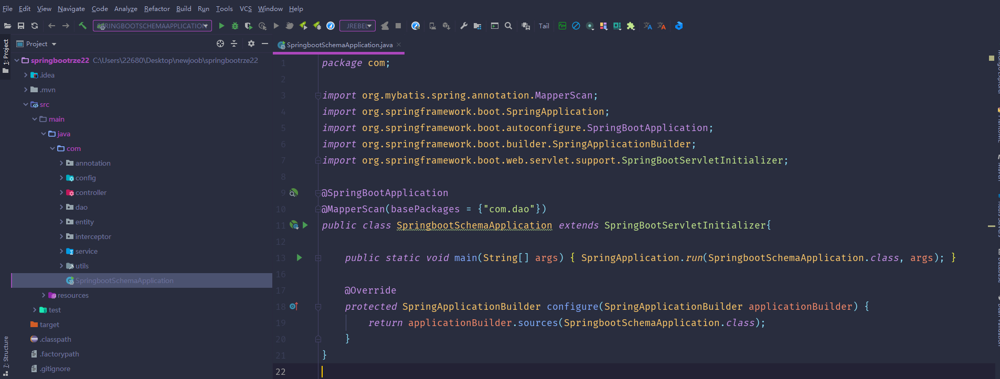

数据库表

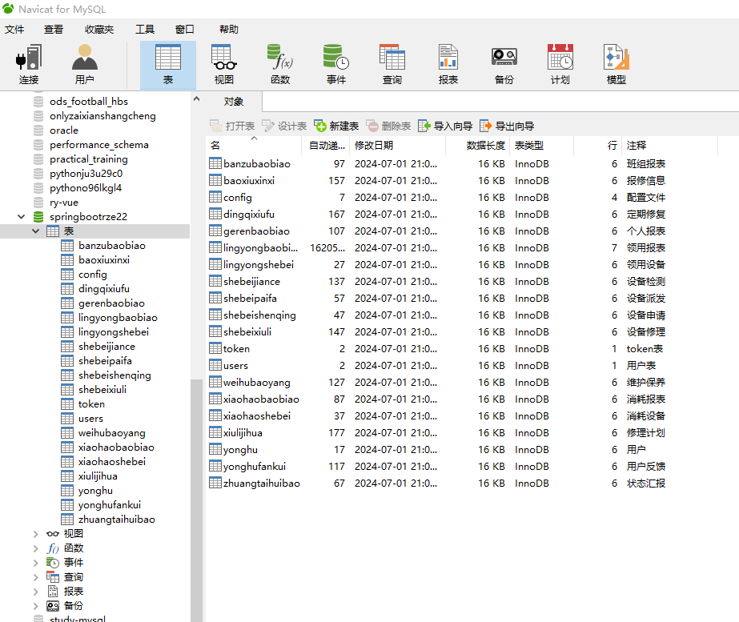

登录

用户端个人信息

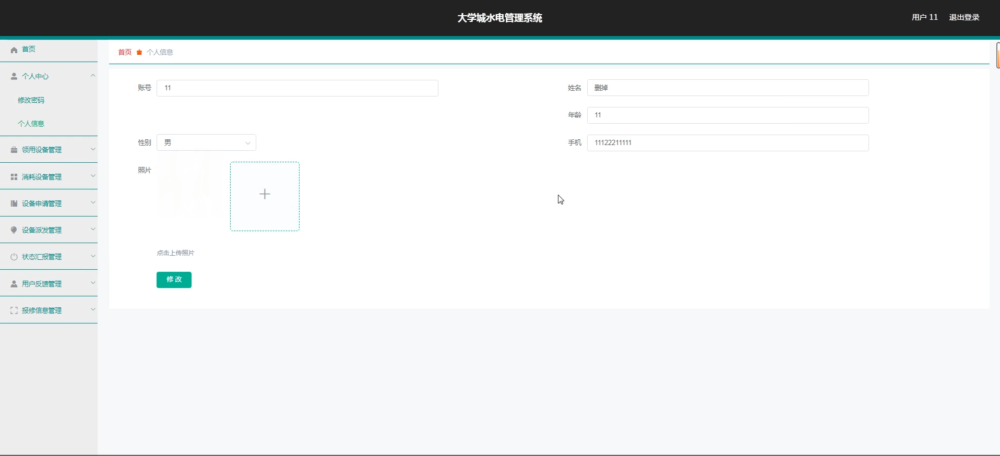

领用设备管理

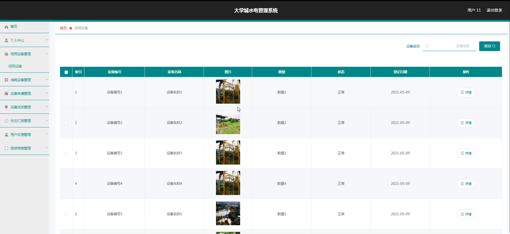

消耗设备管理

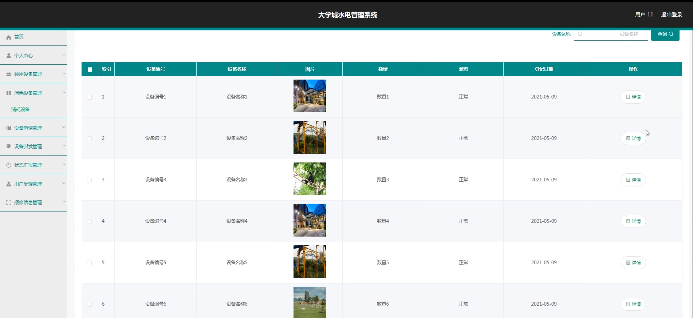

设备申请管理

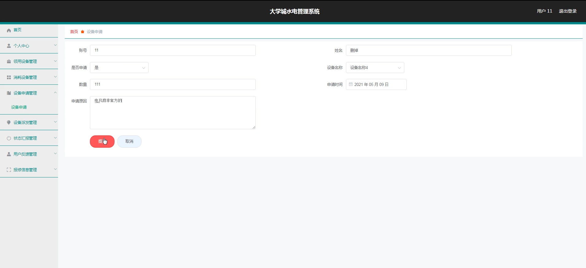

状态汇报管理

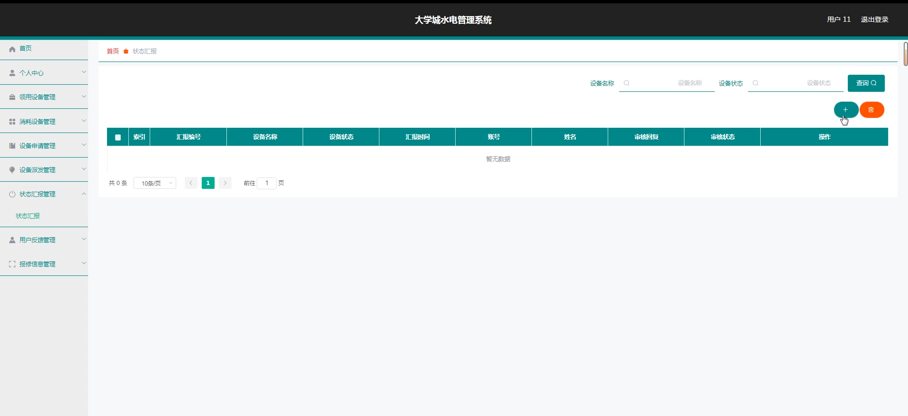

用户反馈管理

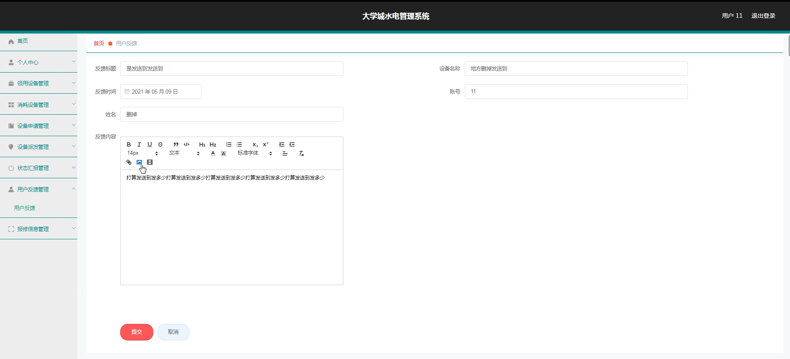

管理员端用户管理

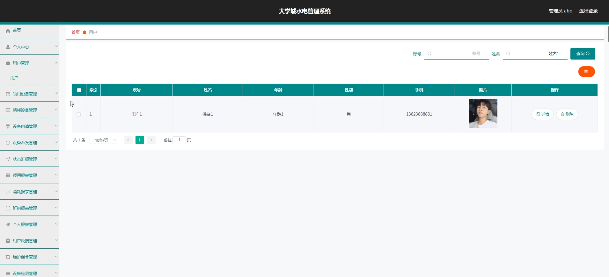

消耗设备管理

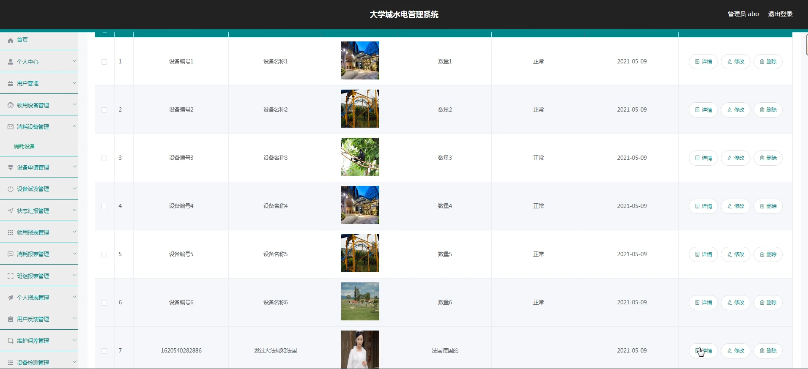

设备派发管理

个人报表管理

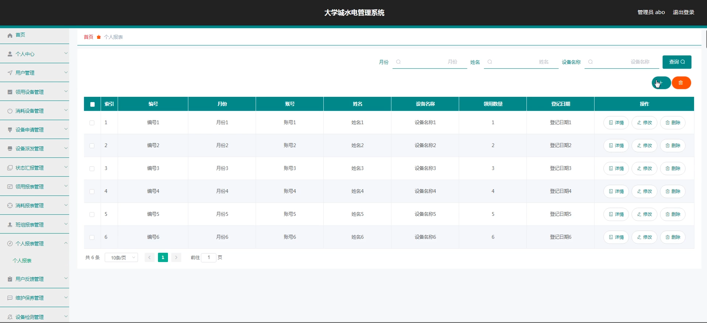

设备检验管理

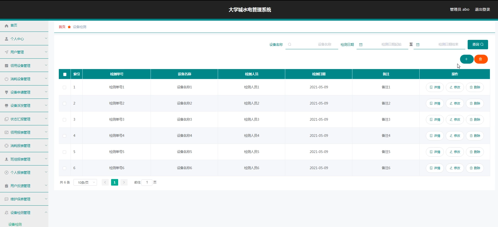

修理计划管理

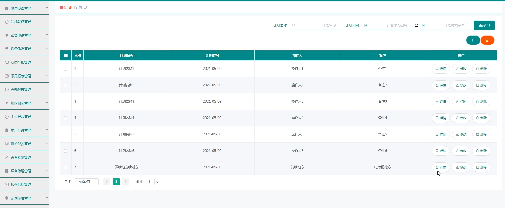

#### 总结

本基于 Spring Boot 的大学城水电管理系统，通过清晰的角色划分和全面的功能模块，实现了大学城水电管理的精细化和智能化。它不仅提高了水电管理的效率和质量，保障了设备的正常运行和资源的合理利用，还为大学城的可持续发展提供了有力支持。未来，我们将继续优化和完善该系统，以适应不断变化的需求和技术发展，为大学城的水电管理创造更大的价值。

#### 使用说明

创建数据库，执行数据库脚本 修改jdbc数据库连接参数 下载安装maven依赖jar 启动idea中的springboot项目

后台地址：http://localhost:8080/springbootrze22/admin/dist/index.html

管理员  abo 密码 abo
